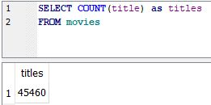

# COUNT

SQL has several aggregate functions, including COUNT, SUM, MIN, MAX, and AVG. Aggregate functions allow you to summarize a column by grouping or 'rolling up' the data.

`SELECT COUNT(title) as titles`&#x20;

`FROM movies`

We can also combine this with a WHERE statement to count the titles which have budgets greater than a million dollars:

We can also add a GROUP BY statement to count the number of titles in each language, with a budget greater than 1000000:

