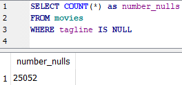

# NULL Values

NULL values occur in fields that are blank.

It is not possible to detect NULL values with the = operator, or with aggregate functions like COUNT or SUM.

You can select rows with NULL values by using IS NULL or IS NOT NULL:

`SELECT COUNT(*) as number_nulls`&#x20;

`FROM movies`&#x20;

`WHERE tagline IS NULL`

