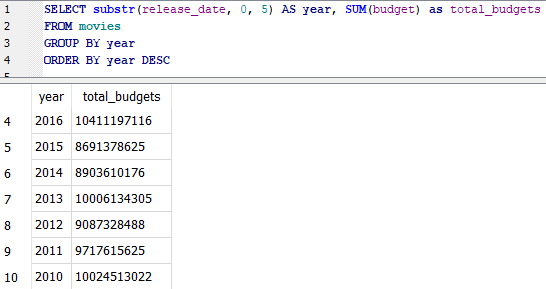

# SUM

<mark style="background-color:purple;">`SELECT substr(release_date, 0, 5) AS year,`</mark>&#x20;

<mark style="background-color:purple;">`SUM(budget) as total_budgets`</mark>&#x20;

<mark style="background-color:purple;">`FROM movies GROUP BY year`</mark>&#x20;

<mark style="background-color:purple;">`ORDER BY year DESC`</mark>

