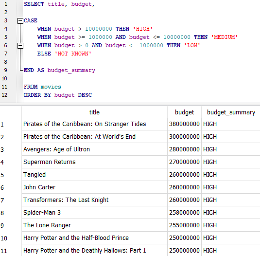

# CASE

CASE statements are useful for broadly describing, or assigning categories to, a range of data.

`SELECT title, budget,`

`CASE`&#x20;

&#x20;   `WHEN budget > 10000000 THEN 'HIGH'`&#x20;

&#x20;   `WHEN budget >= 1000000 AND budget <= 10000000 THEN 'MEDIUM'`&#x20;

&#x20;   `WHEN budget > 0 AND budget <= 1000000 THEN 'LOW'`&#x20;

&#x20;   `ELSE 'NOT KNOWN'`

`END AS budget_summary`

`FROM movies ORDER BY budget DESC`

It can also be helpful to assign the value of 0 to NULL values when aggregating with SUM(). Conversely, it can be helpful to use a CASE statement to replace 0 values with NULL, so they are excluded when aggregating with MIN().

