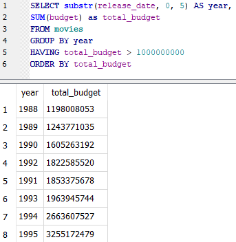

# HAVING

Because of the way that calculations take place in SQL, one can't filter on aggregated fields using WHERE. Instead, we need to use the HAVING statement.

The following query will display the years in which the total of all movie budgets for the year exceeded 1 billion dollars:

`SELECT substr(release_date, 0, 5) AS year,`&#x20;

`SUM(budget) as total_budget`&#x20;

`FROM movies`

`GROUP BY year`&#x20;

`HAVING total_budget > 1000000000`

`ORDER BY total_budget`

