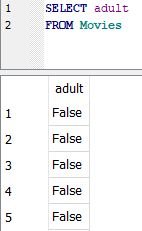
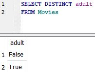

# DISTINCT

****

The adult column in the Movies table contains information on if the Movie contains adult content, which we can see with the SQL query below:

`SELECT adult`&#x20;

`FROM Movies`

**Handling Duplicates**

If we wanted to see what the different values are in the column, we could remove duplicate values with the DISTINCT keyword:

`SELECT DISTINCT adult`&#x20;

`FROM Movies`

