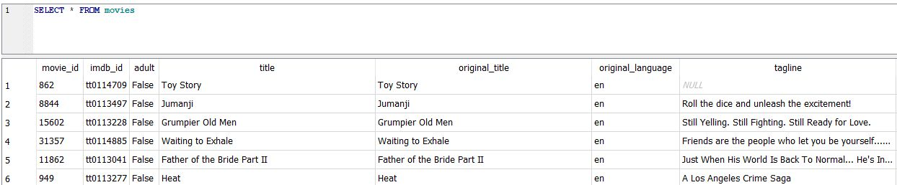

# SELECT

The most basic form of the select statement looks as follows:

`SELECT ColumnNames`&#x20;

`FROM TableNames`&#x20;

There are several optional parts to the statement, including:

`SELECT ColumnNames`&#x20;

`FROM TableNames`&#x20;

`[WHERE Condition]`&#x20;

`[GROUP BY Column]`&#x20;

`[HAVING Condition]`&#x20;

`[ORDER BY Column][ASC | DESC]]`

Note that if a table name consists of more than one word, it will need to be wrapped in parentheses like this:&#x20;

`SELECT Column`&#x20;

`FROM [Movie Details]`

The simplest SELECT STATMENT uses \* to select all columns:

`SELECT * FROM Movies`

Executing this SELECT in SQLite gives the following result:

You can limit the number of columns selected by listing the columns:

`SELECT movie_id, title from Movies`

