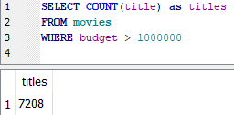

# SUBSTR

Looking at the release date column, you'll notice that the date is in the format yyyy-mm-dd:

`SELECT release_date`&#x20;

`FROM movies`

``

.png>)

If we wanted to get just the year part, we could use the SUBSTR function:

`SELECT title, substr(release_date, 0, 5) AS year`&#x20;

`FROM movies`

