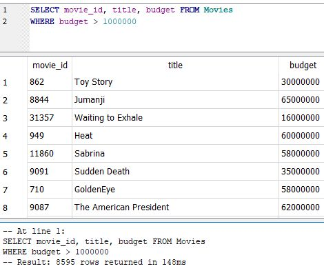
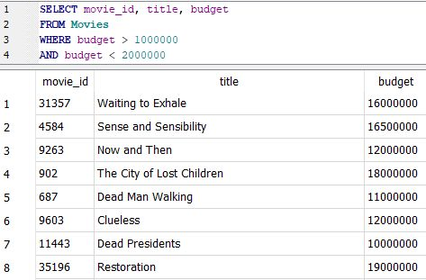

# WHERE

WHERE allows you to filter records returned by the query, based on several operators, including:

| Operator | Meaning                  |
| -------- | ------------------------ |
| =        | Equal to                 |
| <        | Less than                |
| >        | Greater than             |
| <=       | Less than or equal to    |
| >=       | Greater than or equal to |
| <>       | Not equal to             |

**Movies with a budget greater than a million dollars**

`SELECT movie_id, title, budget`

`FROM Movies`&#x20;

`WHERE budget > 1000000`

**AND, OR Statements**

SELECT movie\_id, title, budget&#x20;

FROM Movies&#x20;

WHERE budget > 1000000&#x20;

AND budget < 2000000

